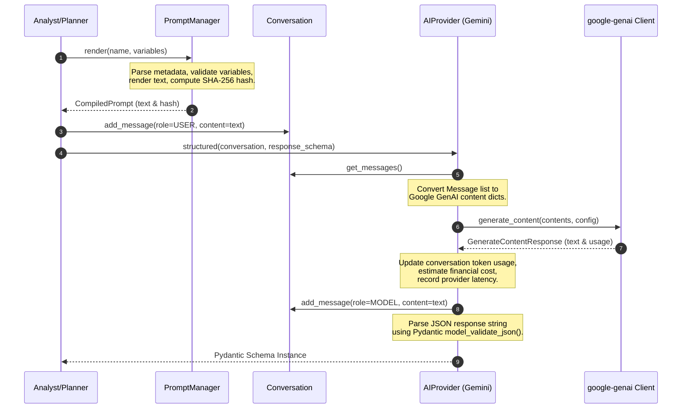

# AI Interaction Sequence Diagram

The diagram below maps the runtime workflow during structured AI generation requests:

```mermaid
sequenceDiagram
    autonumber
    participant Orchestrator as Analyst/Planner
    participant PM as PromptManager
    participant Conv as Conversation
    participant Provider as AIProvider (Gemini)
    participant API as google-genai Client

    Orchestrator->>PM: render(name, variables)
    Note over PM: Parse metadata, validate variables,<br/>render text, compute SHA-256 hash.
    PM-->>Orchestrator: CompiledPrompt (text & hash)
    
    Orchestrator->>Conv: add_message(role=USER, content=text)
    Orchestrator->>Provider: structured(conversation, response_schema)
    
    Provider->>Conv: get_messages()
    Note over Provider: Convert Message list to<br/>Google GenAI content dicts.
    
    Provider->>API: generate_content(contents, config)
    API-->>Provider: GenerateContentResponse (text & usage)
    
    Note over Provider: Update conversation token usage,<br/>estimate financial cost,<br/>record provider latency.
    
    Provider->>Conv: add_message(role=MODEL, content=text)
    Note over Provider: Parse JSON response string<br/>using Pydantic model_validate_json().
    
    Provider-->>Orchestrator: Pydantic Schema Instance
```
