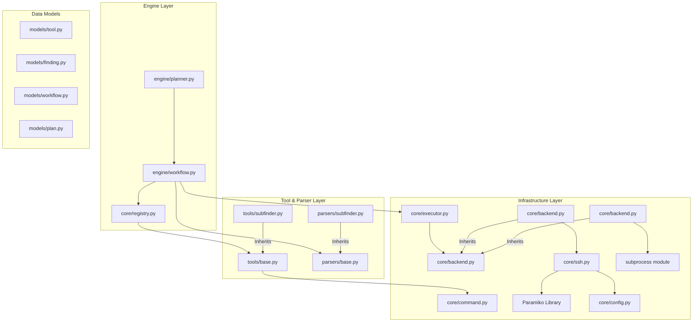

# BugBountyAI Architecture Audit Report

This report evaluates the current codebase state, infrastructure, and core engine modules against the frozen architectural guidelines.

---

## Current Architecture

Below is the conceptual dependency flow of the BugBountyAI engine:

---

## Violations

### 1. Lack of Thread-Safety in SSHClient File Operations
- **Location**: [`core/ssh.py`](file:///c:/BugBountyAI/core/ssh.py)
- **Severity**: **Critical**
- **Issue**: While `execute()` utilizes `self.lock` to ensure thread safety during shell execution, methods like `upload()`, `download()`, `exists()`, and `mkdir()` do not acquire this lock. Concurrently calling file operations will corrupt the shared SFTP channel state.

### 2. Loose Typing and Missing Type Hints in Central Infrastructure
- **Location**: Multiple core modules
- **Severity**: **Medium**
- **Issues**:
  - [`core/registry.py`](file:///c:/BugBountyAI/core/registry.py): `discover`, `get`, and `list` methods lack type hints for parameters and return types.
  - [`core/ssh.py`](file:///c:/BugBountyAI/core/ssh.py): `execute`, `upload`, `download`, `exists`, and `mkdir` contain untyped parameters and return values.
  - [`core/config.py`](file:///c:/BugBountyAI/core/config.py): The `get` method is untyped.

### 3. Missing Docstrings
- **Location**: Multiple infrastructure modules
- **Severity**: **Low**
- **Issues**:
  - [`core/registry.py`](file:///c:/BugBountyAI/core/registry.py): Missing docstrings on the class and its public methods.
  - [`core/config.py`](file:///c:/BugBountyAI/core/config.py): Missing class and method-level docstrings.
  - [`core/ssh.py`](file:///c:/BugBountyAI/core/ssh.py): Classes and methods have sparse docstrings.

### 4. Code Clutter and Empty Mock Modules
- **Location**: Workspace root
- **Severity**: **Low**
- **Issues**:
  - Empty files: [`main.py`](file:///c:/BugBountyAI/main.py), [`core/planner.py`](file:///c:/BugBountyAI/core/planner.py).
  - Unused empty utility modules: [`utils/helpers.py`](file:///c:/BugBountyAI/utils/helpers.py) and [`utils/parser.py`](file:///c:/BugBountyAI/utils/parser.py).
  - Empty directories: `templates/`, `targets/`, and `wordlists/`.

---

## Improvements

1. **Synchronize SFTP in SSHClient**:
   Wrap `upload`, `download`, `exists`, and `mkdir` in `core/ssh.py` with `self.lock` block contexts.
2. **Complete Core Type Hints**:
   Add explicit annotations across `registry.py`, `ssh.py`, and `config.py`.
3. **Core Registry Auto-Discovery for Parsers**:
   Add a `ParserRegistry` class to `core/registry.py` to auto-discover classes inheriting from `parsers.base.Parser`, eliminating direct string imports in the `WorkflowEngine`.

---

## Technical Debt

- **SSH VM Key Verification (`AutoAddPolicy`)**:
  `SSHClient` uses `AutoAddPolicy()` to trust any host key. In production environments, this exposes connections to MitM (Man-in-the-Middle) attacks.
- **Bare Except Block**:
  `LocalBackend.run` catches `Exception` blindly (returning a dummy object). This could swallow syntax or system failures that should be handled explicitly.

---

## Future Extensions

- **New AI Provider**: Implement a subclass of `AIProvider` in `providers/openai.py` or `providers/ollama.py`.
- **New Executor/Backend**: Subclass `ExecutionBackend` for `DockerBackend` or `KubernetesBackend`.
- **New Workflow**: Author a YAML pipeline (e.g. `workflows/api_recon.yaml`) under `workflows/`.
- **New Tool**: Drop a module inheriting from `Tool` under `tools/` and its parser class under `parsers/`.

---

## Security Review

- **Command Injection**:
  Prevented at the design layer using the `Command` dataclass and shell-escaped mapping via `shlex.quote`.
- **Path Traversal**:
  `SSHBackend` file transfers rely on direct user-provided file strings. Safe paths validation should be implemented when user input is supplied to `upload` or `download`.
- **Unsafe YAML**:
  Uses `yaml.safe_load` inside the config and workflow engines, rendering it safe against remote code execution via YAML tags.
- **Credential Leakage**:
  `.env` handles `GEMINI_API_KEY` loading, and host details are in `config/config.yaml` to ensure secrets are kept out of source code.

---

## Performance Review

- **SSH Connection Pooling**:
  `SSHClient` maintains a persistent paramiko client after the first connection (`connect-on-demand`). However, there is no automatic idle timeout, which might leak connections.
- **AI Token Waste**:
  Chat histories are fully appended, which is expected but could benefit from a summary mechanism once history depth grows.

---

## Scalability Review

This architecture is robust and ready to support:
- **100+ Tools/Parsers**: Auto-discovered via `pkgutil` dynamically, scaling without registry modifications.
- **100+ Workflows**: Fully parameterized via YAML definitions without updating Python logic.
- **10+ AI Providers**: Subclassing `AIProvider` handles backend changes seamlessly.
- **Distributed workers**: Easily introduced by injecting custom `ExecutionBackend` classes.
