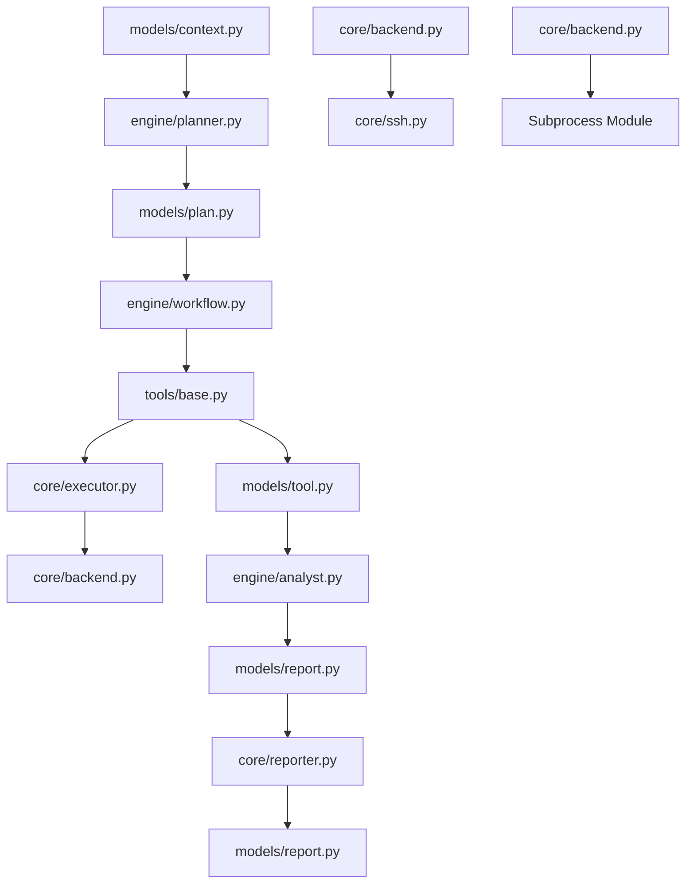

# BugBountyAI Frozen Architecture (v1.0)

This document describes the permanently frozen architecture, directory structure, module boundaries, data flow, and extension points of the BugBountyAI engine.

---

## Directory Layout & Boundaries

```text
BugBountyAI/
├── core/                # Infrastructure only (no business logic)
│   ├── backend.py       # ExecutionBackend, SSHBackend, LocalBackend
│   ├── command.py       # Structured Command dataclass (arguments list)
│   ├── executor.py      # Executor (delegates tasks to ExecutionBackend)
│   ├── ssh.py           # Thread-safe SSHClient (Paramiko wrapper)
│   ├── registry.py      # Dynamic tool plugin discovery
│   ├── config.py        # Config mapping and loading
│   ├── events.py        # Abstract events system (ToolStarted, WorkflowFinished, etc.)
│   └── logger.py        # Centralized logger
├── engine/              # Engine orchestration logic
│   ├── planner.py       # Orchestrator (AI-assisted or static execution paths)
│   ├── workflow.py      # WorkflowEngine (YAML parser & sequencer)
│   └── analyst.py       # Triage logic (AI-assisted or rule-based)
├── memory/              # Multi-scan persistence interfaces (Cache, History, KnowledgeBase)
│   ├── cache.py
│   ├── history.py
│   └── knowledge.py
├── models/              # Strongly-typed dataclasses for boundaries
│   ├── context.py       # ScanContext (workspace directories, targets, vars)
│   ├── tool.py          # ToolMetadata, ToolResult (never subclassed)
│   ├── finding.py       # Finding, open ports, subdomains
│   ├── workflow.py      # WorkflowStep, Workflow definitions
│   ├── plan.py          # Plan, PlanResult
│   └── report.py        # ScanReport, ReportMetadata, AnalysisResult
├── providers/           # AI reasoning provider wrappers
│   ├── base.py          # AIProvider ABC
│   └── gemini.py        # GeminiProvider (google-genai SDK wrapper)
├── tools/               # Tool plugins (self-contained validate/build/parse/execute logic)
│   ├── base.py          # Tool ABC
│   └── subfinder.py     # subfinder Tool plugin
├── workflows/           # YAML workflow pipelines (e.g. recon.yaml)
└── prompts/             # Markdown prompts for AI planners, analysts, and reporters
```

---

## Flow & Dependency Architecture



### Module Boundary Rules

1. **Strong Typing & Contexts**: 
   No raw strings or dictionaries are passed between primary boundaries. The execution starts with a `ScanContext` and transitions cleanly between `Plan`, `ToolResult`, `AnalysisResult`, and `ScanReport`.
2. **Tools Handle Parsing**: 
   No separate `parsers/` directory exists. Tools implement `parse(self, stdout: str)` and populate their specific extracted fields directly into the `ToolResult.metadata` dict.
3. **Execution Backend Decoupling**: 
   Tools only build a structured `Command` (executable, arguments). The `Executor` and its injected `ExecutionBackend` handle target operating system escaping and execution details.

---

## Extension Points

1. **New Security Tools**:
   Create a class inheriting from `Tool` under `tools/`. Registry auto-discovery registers it automatically.
2. **New Workflows**:
   Author new YAML scan steps inside `workflows/`. WorkflowEngine parses them dynamically.
3. **New AI Providers**:
   Subclass `AIProvider` under `providers/` (e.g. `providers/openai.py`) to wrap alternative models.
4. **New Execution Environments**:
   Subclass `ExecutionBackend` under `core/backend.py` (e.g. `DockerBackend`, `KubernetesBackend`).
