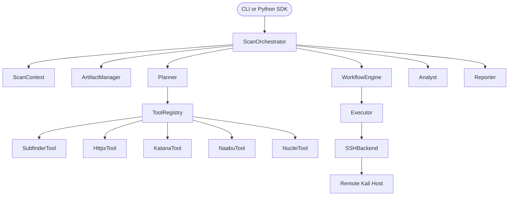
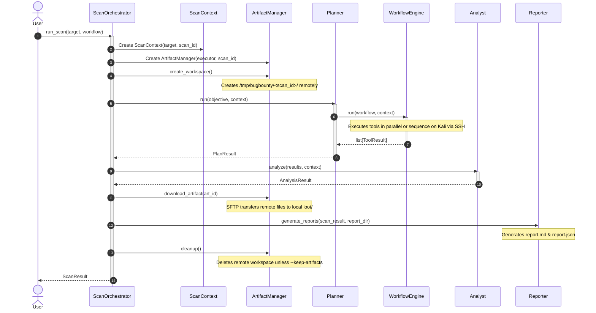

# BugBountyAI Scanning Engine

BugBountyAI is an AI-native, production-grade scanning engine built for modular, robust reconnaissance and vulnerability audits. It supports parallel execution of tools via SSH backends, dynamic workspace tracking, and custom workflow specifications.

---

## 1. Engine Architecture

### Architecture Diagram


### Execution Sequence Diagram


---

## 2. CLI Usage Reference

The scanning engine is exposed via the `bugbounty` executable command.

```bash
bugbounty <target> [options]
```

### Options

| Flag | Description | Default |
| :--- | :--- | :--- |
| `target` | Target domain, URL, or host to analyze (Required) | None |
| `--workflow` | Force execution of a specific workflow | None |
| `--output` | Local directory path to store JSON/MD reports | `reports/<target>` |
| `--json` | Emit serialized JSON output report to stdout | `False` |
| `--keep-artifacts` | Preserve remote workspace files on the Kali box | `False` |
| `--workspace` | Remote workspace root prefix override path | `/tmp/bugbounty` |
| `--scan-id` | Predefined Custom Scan ID UUID | Generated UUID |
| `--no-ai` | Disable AI provider triaging/validation logic | `False` |
| `--verbose` | Enable verbose debug logs to stdout | `False` |

### Example Commands

```bash
# Basic reconnaissance scan on example.com
bugbounty example.com

# Reconnaissance scan bypassing AI analysis
bugbounty example.com --no-ai

# Save reports to custom local directory
bugbounty example.com --output /opt/results

# Print structured JSON results directly to stdout
bugbounty example.com --json

# Keep remote artifacts in Kali VM for manual debugging
bugbounty example.com --keep-artifacts
```

---

## 3. SDK Reference (Python API)

You can import and trigger scans programmatically from other Python scripts:

```python
from bugbounty import scan

result = scan(
    target="example.com",
    workflow="recon",
    no_ai=True,
    keep_artifacts=False
)

print(f"Scan Finished: {result.success}")
print(f"Scan ID: {result.scan_id}")
print(f"Total findings: {len(result.analysis_result.findings)}")
for artifact in result.artifacts:
    print(f"Local file downloaded: {artifact.local_path}")
```

---

## 4. Tool Plugin Development Guide

All scanner tools in the engine inherit from the base `Tool` class and are automatically discovered by the `ToolRegistry`.

### Plugin Architecture Rules
1. **Never subclass ToolResult**: Return a standard `ToolResult` instance.
2. **Encapsulate CLI arguments**: Do not specify hardcoded tool-specific flags (e.g. `-silent`, `-json`, `-o`) in the workflow YAML. The Tool class must build these parameters in the `build()` method.
3. **Use Executor**: Never execute commands directly. Always delegate tasks through the `Executor` passed to the `execute()` method.

### How to Add a New Tool Plugin

Follow this step-by-step example to add a tool named **customtool**:

#### Step 1: Create the Plugin File
Create `tools/customtool.py`:

```python
from typing import Any
from core.command import Command
from models.tool import ToolMetadata
from tools.base import Tool

class CustomtoolTool(Tool):
    """
    Tool plugin for customtool running scans.
    """
    metadata = ToolMetadata(
        name="customtool",
        version="1.0.0",
        author="BugBountyAI",
        description="Scans custom target resources",
        tags=["recon", "custom"],
        category="recon",
        requirements=["customtool"],
        supports_parallel=True,
    )

    def validate(self, **kwargs) -> None:
        """Validate input arguments."""
        if "target" not in kwargs:
            raise ValueError("Parameter 'target' is required for customtool.")

    def build(self, **kwargs) -> Command:
        """Construct command arguments, handling output files."""
        args = ["-silent"]
        args.extend(["-t", kwargs["target"]])
        
        if "output_file" in kwargs:
            args.extend(["-o", kwargs["output_file"]])
            
        return Command(executable="customtool", args=args)

    def parse(self, stdout: str) -> dict[str, Any]:
        """Structure raw output into standard dictionary."""
        items = [line.strip() for line in stdout.splitlines() if line.strip()]
        return {"items": items}
```

#### Step 2: Register in Workflow
Add the step to a workflow YAML file (e.g. `workflows/recon.yaml`):

```yaml
  - tool: customtool
    args:
      target: "{{ target }}"
      output_file: "/tmp/bugbounty/{{ scan_id }}/custom_output.txt"
    depends_on:
      - subfinder
```
The engine will load the tool, validate, construct commands, run via SSH, parse output, register `/tmp/bugbounty/<scan_id>/custom_output.txt` as a download artifact, and download it locally.
